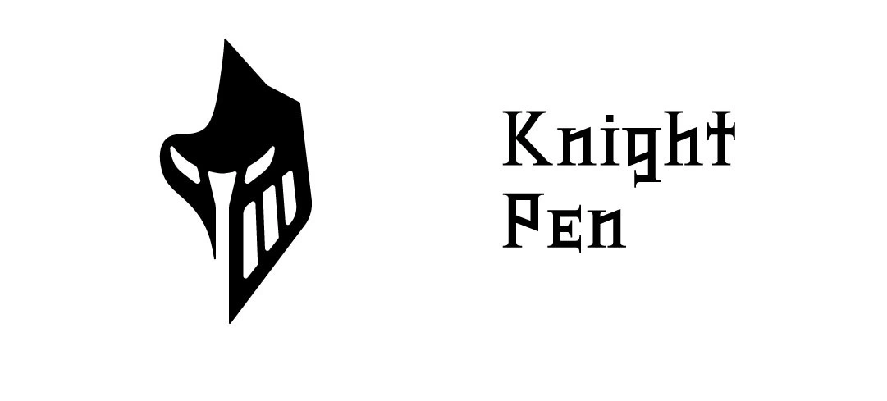

# Knight Pen
 

A simple screen annotation software.

    

 

<!-- # Preview -->

## TO-DO
- [x] Added custom <a href="./extera/icon-font">icon-font</a>.
- [x] Fixed dragging issues.
- [ ] Fix mask problem in custom <a href="./src/knight-pen/maskwindow.h">window</a>.
- [ ] Add shape selection.
- [ ] Add other pen & brush tools.
- [ ] Capability to move selection.
- [ ] Capability to rotate selection.
- [ ] Capability to resize selection.
- [ ] Capability to translate selection.
- [ ] Capability to intersect shapes.
- [ ] Move InteractiveCanvas component to separate repository.

## Dependencies
- [Qt](https://www.qt.io/) (LGPLV3) Core & GUI
- [QNanoPainter](https://github.com/QUItCoding/qnanopainter) (zlib license) Canvas