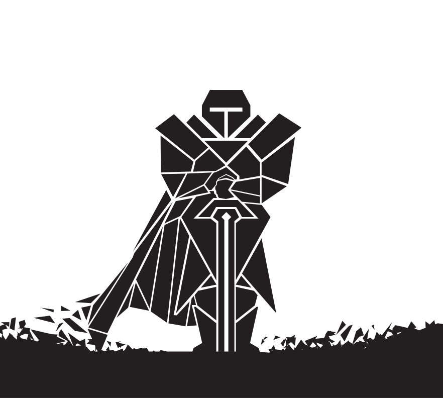

# </img> Knight Pen


<a href="https://www.blockchain.com/bch/address/bitcoincash:qrnwtxsk79kv6mt2hv8zdxy3phkqpkmcxgjzqktwa3">
</a>
<br><br>

An easy-to-use screen annotation program.

<div align="center">
     <br>
    <i><small>Knight Pen</small></i>
</div>
<br>

<!-- # Preview -->

## Building from source

**Dependencies**

`Qt >= 5.15`, `GCC >= 8.0`, `qmake >= 3.1`.
```bash
sudo apt-get install g++ build-essential qt5-default qttools5-dev qttools5-dev-tools qtdeclarative5-dev*
```

**Clone repository**
```bash
git clone --recursive https://github.com/SMR76/knight-pen.git
```

**‌Build**
```bash
cd knight-pen
mkdir build
cd build
qmake CONFIG+=release ../src/knight-pen/
make
```

## TO-DO
- [ ] Fix scale issues on linux.
- [ ] Add other pen & brush tools.
- [ ] Capability to move selection.
- [ ] Capability to rotate selection.
- [ ] Capability to resize selection.
- [ ] Capability to translate selection.
- [ ] Capability to intersect shapes.
- [ ] Separate the current shape drawing from all other solid shapes to improve rendering.
- [ ] Move InteractiveCanvas component to separate repository.
- [ ] Port to cmake.
- [ ] Use [traypp](https://github.com/Soundux/traypp) ([Qt BUG](https://bugreports.qt.io/browse/QTBUG-37083)).
- [ ] Fix [WToolTip](src/knight-pen/controls/WToolTip.qml) performance issue.

## Dependencies
- [Qt](https://www.qt.io/) (LGPLV3) <sub>Core & GUI</sub>
- [QNanoPainter](https://github.com/QUItCoding/qnanopainter) (zlib license) <sub>Canvas</sub>